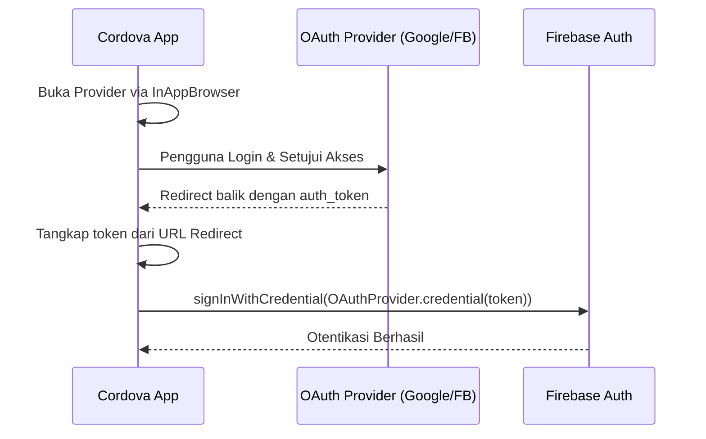

# 🚀 Panduan Migrasi: Firebase Dynamic Links Sunset

Dokumen ini menjelaskan langkah-langkah migrasi lengkap setelah penutupan resmi layanan **Firebase Dynamic Links (FDL)** pada **25 Agustus 2025**. Penutupan FDL berdampak langsung pada dua fitur otentikasi utama jika aplikasi Anda menggunakannya:
1. **Email Link Authentication** pada aplikasi mobile (Android & iOS).
2. **Cordova OAuth Support** pada aplikasi web/hybrid mobile.

Ikuti panduan di bawah ini untuk memperbarui konfigurasi backend, mobile app, dan hybrid app Anda agar alur otentikasi tetap berjalan normal.

---

## 📋 Ikhtisar Perubahan Utama

| Fitur yang Terdampak | Metode Lama (FDL) | Metode Baru (Rekomendasi Firebase) |
| :--- | :--- | :--- |
| **Email Link Auth (Mobile)** | Menggunakan domain FDL (misal `app.page.link`) | Menggunakan domain **Firebase Hosting** (misal `app.firebaseapp.com` atau custom domain Anda) |
| **Cordova OAuth (Web/Hybrid)** | Menggunakan skema redirect otomatis lewat FDL | Menggunakan **Manual OAuth Handling** (membuka provider via InAppBrowser, mendapatkan token, lalu sign-in dengan credential) |

---

## 🔒 Bagian 1: Migrasi Email Link Authentication (Mobile App)

Firebase Authentication kini menggunakan domain **Firebase Hosting** proyek Anda untuk menangani tautan tindakan email (seperti verifikasi email, pengaturan ulang kata sandi, dan masuk tanpa kata sandi).

### Langkah 1: Hubungkan Domain Firebase Hosting di Backend

Anda harus mengonfigurasi proyek Firebase agar mengalihkan pembuatan tautan tindakan email dari FDL ke domain Firebase Hosting Anda. Kami telah menyediakan Artisan command di repositori **Laravel Starter** untuk melakukan ini secara otomatis.

1. Buka terminal pada proyek **Laravel Starter** Anda.
2. Jalankan perintah Artisan berikut dengan memasukkan domain Firebase Hosting Anda (biasanya `[PROJECT_ID].firebaseapp.com` atau custom domain terdaftar):

```bash
# Menggunakan domain default firebaseapp.com
php artisan firebase:configure-mobile-links your-project-id.firebaseapp.com

# Atau menggunakan custom domain jika terdaftar di Firebase Hosting
php artisan firebase:configure-mobile-links auth.yourdomain.com
```

*Perintah ini akan memperbarui properti `mobileLinksConfig` di Firebase Auth menggunakan Firebase Admin SDK secara instan.*

---

### Langkah 2: Konfigurasi Native Android (App Links)

Karena tautan otentikasi sekarang dikirim melalui domain Firebase Hosting Anda, aplikasi Android harus didaftarkan untuk menangani domain baru ini sebagai Android App Links.

1. Buka file `apps/main/android/app/src/main/AndroidManifest.xml` (dan lakukan hal yang sama untuk flavor `variant` jika ada).
2. Tambahkan atau perbarui `<intent-filter>` di dalam `<activity>` utama Anda (biasanya `MainActivity`):

```xml
<!-- Intent Filter untuk Menangkap Email Link Auth di Domain Firebase Hosting -->
<intent-filter android:autoVerify="true">
    <action android:name="view" />
    <category android:name="android.intent.category.default" />
    <category android:name="android.intent.category.browsable" />
    
    <!-- Ganti dengan domain Firebase Hosting Anda -->
    <data android:scheme="https" android:host="your-project-id.firebaseapp.com" />
    <data android:scheme="https" android:host="auth.yourdomain.com" />
    
    <!-- Path action default Firebase Auth -->
    <data android:pathPrefix="/__/auth/action" />
</intent-filter>
```

3. **AssetLinks JSON**: Pastikan Firebase Hosting Anda menyajikan file `assetlinks.json` yang valid di path:
   `https://[YOUR_HOSTING_DOMAIN]/.well-known/assetlinks.json`
   *Catatan: Firebase Authentication menangani hal ini secara otomatis saat Anda menggunakan domain bawaan `firebaseapp.com`.*

---

### Langkah 3: Konfigurasi Native iOS (Universal Links)

Anda harus memperbarui hak Associated Domains aplikasi iOS Anda untuk mendukung Universal Links dari domain Firebase Hosting yang baru.

1. Buka proyek iOS Anda di Xcode (`apps/main/ios/Runner.xcworkspace`).
2. Pilih target proyek **Runner** -> Tab **Signing & Capabilities**.
3. Klik tombol `+ Capability` dan tambahkan **Associated Domains**.
4. Tambahkan domain baru Anda ke dalam daftar dengan format `applinks:`:
   - `applinks:your-project-id.firebaseapp.com`
   - `applinks:auth.yourdomain.com`
5. Tambahkan path prefix `/__/auth/action` untuk memastikan hanya tautan otentikasi yang ditangani oleh aplikasi:
   - `applinks:your-project-id.firebaseapp.com?mode=action`

6. **Apple App Site Association (AASA)**: Pastikan file AASA dapat diakses di:
   `https://[YOUR_HOSTING_DOMAIN]/.well-known/apple-app-site-association`
   *Catatan: Firebase Hosting membuat file ini secara otomatis di domain default. Jika menggunakan custom domain, pastikan file ini dikonfigurasi dengan benar.*

---

### Langkah 4: Sesuaikan Kode Flutter Anda

Pada aplikasi Flutter, sesuaikan pendengar tautan dalam aplikasi (misal menggunakan paket `app_links` atau `uni_links`) untuk menangkap domain baru ini.

```dart
// Contoh penanganan link masuk di Flutter
import 'package:app_links/app_links.dart';

final _appLinks = AppLinks();

void initDeepLinkListener() {
  _appLinks.uriLinkStream.listen((Uri uri) {
    if (uri.path.contains('/__/auth/action')) {
      final mode = uri.queryParameters['mode'];
      final oobCode = uri.queryParameters['oobCode'];
      
      if (mode == 'signIn') {
        // Lakukan sign-in dengan email link menggunakan oobCode
        _handleEmailLinkSignIn(uri.toString());
      }
    }
  });
}
```

---

## 📱 Bagian 2: Migrasi Cordova OAuth Flow (Web & Hybrid App)

Sebelum FDL didepresiasi, Firebase JS SDK di Cordova menggunakan FDL untuk mengarahkan kembali pengguna dari alur OAuth (seperti Google, Facebook, atau GitHub Sign-In) kembali ke aplikasi mobile hybrid (`file:///` atau `localhost`).

Setelah FDL ditutup, Anda harus beralih ke **Manual OAuth handling**.

### Arsitektur Alur Manual OAuth



### Langkah Implementasi Manual OAuth

1. Instal plugin Cordova **InAppBrowser** untuk membuka jendela autentikasi eksternal secara aman:
   ```bash
   cordova plugin add cordova-plugin-inappbrowser
   ```

2. Jalankan alur otentikasi secara manual di kode JavaScript aplikasi Anda:

```javascript
import { initializeApp } from "firebase/app";
import { getAuth, signInWithCredential, GoogleAuthProvider } from "firebase/auth";

const firebaseConfig = { /* config Anda */ };
const app = initializeApp(firebaseConfig);
const auth = getAuth(app);

function loginWithGoogleCordova() {
  // 1. Buat URL OAuth Provider secara manual
  const clientId = "YOUR_GOOGLE_CLIENT_ID.apps.googleusercontent.com";
  const redirectUri = "https://your-project-id.firebaseapp.com/__/auth/handler";
  const authUrl = `https://accounts.google.com/o/oauth2/v2/auth?client_id=${clientId}&redirect_uri=${redirectUri}&response_type=token&scope=profile%20email`;

  // 2. Buka URL menggunakan InAppBrowser
  const browser = cordova.InAppBrowser.open(authUrl, '_blank', 'location=no,clearcache=yes,clearsessioncache=yes');

  // 3. Dengarkan event loadstart/loadstop untuk menangkap token redirect
  browser.addEventListener('loadstart', (event) => {
    if (event.url.startsWith(redirectUri)) {
      // Ambil token dari URL hash/query
      const urlParams = new URLSearchParams(new URL(event.url).hash.substring(1));
      const accessToken = urlParams.get('access_token');

      if (accessToken) {
        // Tautan berhasil masuk, tutup browser
        browser.close();

        // 4. Buat credential Firebase dan lakukan Sign-In
        const credential = GoogleAuthProvider.credential(null, accessToken);
        signInWithCredential(auth, credential)
          .then((userCredential) => {
            console.log("Login sukses!", userCredential.user);
          })
          .catch((error) => {
            console.error("Login Firebase gagal:", error);
          });
      }
    }
  });
}
```

---

## 🔍 Cara Verifikasi Migrasi

1. **Jalankan Verifikasi Backend**:
   Pastikan konfigurasi mobileLinksConfig berhasil diperbarui dengan memanggil `firebase:configure-mobile-links` dan pastikan tidak ada pesan error.
2. **Uji Pengiriman Email**:
   Picu email sign-in dari aplikasi mobile Anda, dan periksa tautan yang diterima di kotak masuk email Anda. Pastikan tautan tersebut menggunakan domain **Firebase Hosting** Anda (misalnya `https://your-project-id.firebaseapp.com/__/auth/action?...`) dan bukan domain `page.link`.
3. **Uji Buka Aplikasi (Deep Link)**:
   Ketuk tautan email tersebut dari perangkat mobile Anda. Pastikan sistem operasi (Android/iOS) secara langsung meluncurkan aplikasi Anda tanpa membuka browser web terlebih dahulu.
