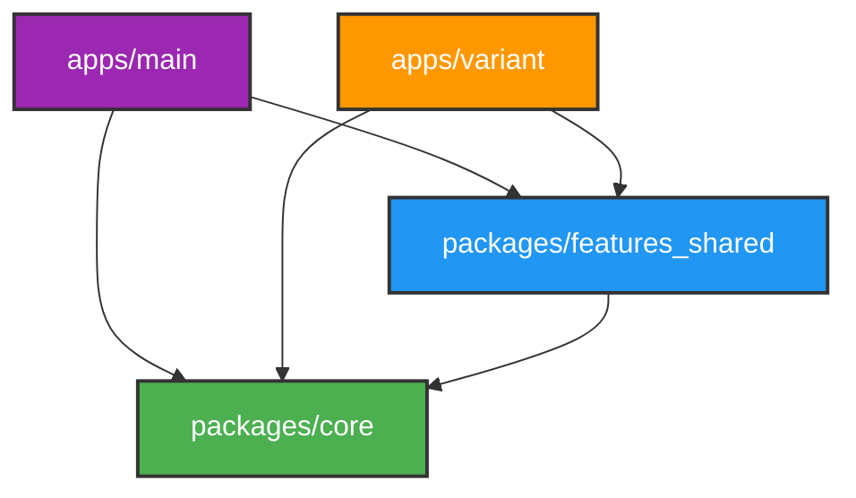

# 📦 Modul 1: Memahami Monorepo & Melos

Bagi pemula, melihat proyek dengan banyak folder `pubspec.yaml` sering kali membingungkan. Biasanya, satu aplikasi Flutter berada dalam satu repositori tunggal. Proyek ini berbeda—ia menggunakan pendekatan **Monorepo**.

Mari kita bedah apa itu Monorepo, kegunaan Melos, dan aturan penting di dalamnya!

---

## 1. Apa itu Monorepo?

**Monorepo (Monolithic Repository)** adalah strategi pengembangan perangkat lunak di mana beberapa proyek atau *package* disimpan dalam satu repositori Git yang sama. 

Di dalam proyek ini, kita memiliki:
1. **`apps/main`**: Aplikasi Flutter utama (misalnya aplikasi untuk pengguna umum).
2. **`apps/variant`**: Aplikasi varian lain (misalnya aplikasi *white-label* untuk klien tertentu).
3. **`packages/core`**: Fondasi kode yang digunakan bersama oleh semua aplikasi (tema, jaringan, database local, helper).
4. **`packages/features_shared`**: Modul-modul fitur siap pakai (seperti `auth`, `profile`, `settings`) yang bisa dipasang di aplikasi mana pun.

> [!NOTE]
> Dengan monorepo, kita tidak perlu menduplikasi kode seperti `AuthScreen` jika ingin membuat dua aplikasi berbeda. Cukup buat fiturnya di `features_shared`, lalu pasang di `apps/main` dan `apps/variant`.

---

## 2. Mengapa Menggunakan Melos?

Jika kita memiliki banyak *package*, mengelola dependensi bisa menjadi mimpi buruk. Misalnya, setiap kali kita menambah library baru di `core`, kita harus menjalankan `flutter pub get` di semua sub-folder secara manual.

**Melos** adalah *workspace manager* untuk monorepo Dart/Flutter. Melos bertugas:
* Menghubungkan dependensi antar *packages* lokal (disebut *bootstrapping*).
* Menjalankan perintah secara massal ke seluruh package (seperti *analyze*, *format*, *test*, *codegen*).

### Perintah Melos yang Wajib Diketahui Pemula:

| Perintah CLI | Apa yang Sebenarnya Terjadi di Balik Layar? |
| :--- | :--- |
| `dart pub get` | Mengunduh dependensi awal di root folder. |
| `dart run melos bootstrap` | Menghubungkan paket lokal (misal: membiarkan `apps/main` mengenali `core` lokal) dan menjalankan `pub get` di semua sub-package secara otomatis. |
| `dart run melos run codegen` | Menjalankan *build_runner* secara bersamaan di semua package yang membutuhkan generator kode (Riverpod, Drift, dll.). |
| `dart run melos run test` | Menjalankan seluruh unit & widget test di semua folder sekaligus. |

---

## 3. Aturan Dependensi Arah Tunggal (Strict Dependency Rule)

Agar arsitektur monorepo tidak menjadi berantakan ("spaghetti"), proyek ini menerapkan aturan dependensi satu arah yang **sangat ketat**:



* **`core`** berada di tingkat paling bawah. `core` **TIDAK BOLEH** mengimpor kode apa pun dari `features_shared` maupun dari `apps`.
* **`features_shared`** boleh mengimpor `core`, tetapi **TIDAK BOLEH** mengimpor kode apa pun dari folder `apps`.
* **`apps`** berada di tingkat teratas. Aplikasi boleh mengimpor modul dari `core` dan `features_shared`.

> [!CAUTION]
> Melanggar aturan arah dependensi ini akan menyebabkan *circular dependency* (saling ketergantungan melingkar) yang membuat aplikasi gagal dikompilasi!

---

## 4. Konvensi Import: Relative vs Barrel Import

Salah satu kesalahan pemula yang paling sering ditemukan di monorepo adalah cara menulis `import`.

### Aturan 1: Gunakan *Relative Import* di Dalam Package Sendiri
Jika Anda sedang menulis kode di dalam folder `packages/features_shared/lib/src/...`, dan ingin mengimpor berkas lain yang **masih berada di dalam package `features_shared` yang sama**, Anda **WAJIB** menggunakan *relative import*.

```dart
// ✅ BENAR (Relative import)
import '../domain/entities/user.dart';
import 'auth_state.dart';

// ❌ SALAH (Jangan gunakan absolute package import untuk internal package)
import 'package:features_shared/src/auth/domain/entities/user.dart';
```

### Aturan 2: Gunakan *Barrel Import* dari Luar Package
Jika Anda sedang menulis kode di `apps/main` dan ingin menggunakan fitur dari `features_shared` atau `core`, Anda **DILARANG** mengimpor file internal (`lib/src/...`) secara langsung. Anda **WAJIB** mengimpor via berkas pintu utama (*barrel export*).

```dart
// ✅ BENAR (Barrel import melalui gerbang utama)
import 'package:features_shared/features_shared.dart';
import 'package:core/core.dart';

// ❌ SALAH (Jangan mengintip folder internal src package lain secara langsung)
import 'package:features_shared/src/auth/presentation/login_screen.dart';
```

Mengapa ini penting? Karena folder `src` dianggap sebagai area privat dari package tersebut. Pintu keluar-masuk resmi hanya melalui file barrel utama di root package (`core.dart` atau `features_shared.dart`).

---

Modul berikutnya akan membahas tentang bagaimana folder di dalam package fitur disusun menggunakan Clean Architecture!

👉 **[Lanjut ke Modul 2: Clean Architecture](file:///c:/Users/62822/Documents/Work/flutter/flutter-starter/docs/tutorial/02_clean_architecture.md)**
