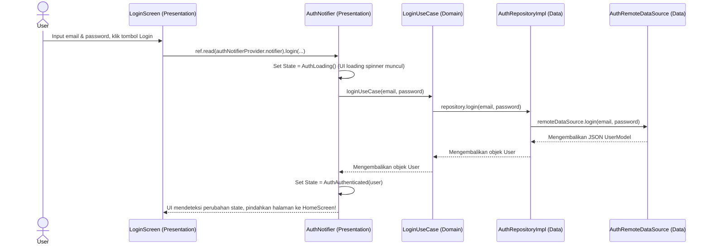

# 🏗️ Modul 2: Menguasai Clean Architecture

Ketika pertama kali melihat modul fitur seperti `auth` atau `profile`, programmer pemula sering bertanya: *"Mengapa kita butuh begitu banyak folder dan berkas untuk tugas sederhana seperti melakukan login?"*

Jawabannya adalah **Clean Architecture**. Pola ini memisahkan kode berdasarkan fungsinya agar mudah diuji (*testable*), mudah diganti komponennya (misal ganti REST API ke GraphQL), dan terstruktur rapi.

Mari kita pelajari 3 layer utama di starter project ini!

---

## 1. Tiga Layer Utama

Setiap fitur yang Anda buat menggunakan perintah `mason make feature` akan secara otomatis memiliki 3 folder utama: `data`, `domain`, dan `presentation`.

```
feature_name/
├── data/          ← Bekerja dengan Database & API (Dunia Luar)
├── domain/        ← Logika Bisnis Utama (Aturan Murni Dart)
└── presentation/  ← Tampilan UI & State Management (Widget & Notifier)
```

---

## 2. Bedah Layer Secara Mendalam

Mari kita telusuri peran masing-masing layer dengan studi kasus fitur **Login**:

### A. Domain Layer (Otak Aplikasi)
Domain layer adalah bagian paling penting. Layer ini adalah **pure Dart** (tidak boleh mengimpor Flutter, UI, Dio, atau Drift). Layer ini berisi aturan bisnis inti aplikasi Anda.

1. **Entity**: Representasi objek data bisnis yang murni.
   * *Contoh*: `User` class dengan properti `id`, `name`, dan `email`.
2. **Repository Contract (Abstract Class)**: Deklarasi fungsi-fungsi apa saja yang harus tersedia, tetapi tanpa menulis implementasi detailnya.
   * *Contoh*: `abstract class AuthRepository` mendeklarasikan `Future<User> login(String email, String password);`.
3. **UseCase**: Logika spesifik untuk satu aksi bisnis tertentu. Satu UseCase hanya boleh melakukan **satu tugas**.
   * *Contoh*: `LoginUseCase` bertugas memvalidasi email/password lalu memanggil repository untuk eksekusi login.

> [!TIP]
> Mengapa menggunakan abstract class di domain? Agar jika kelak kita ingin membuat unit test, kita bisa membuat repository palsu (*MockAuthRepository*) dengan mudah tanpa perlu terhubung ke jaringan asli!

---

### B. Data Layer (Sumber Data)
Data layer bertugas mengambil data dari dunia luar (Internet/REST API, Local database Drift, Shared Preferences) lalu menyalurkannya ke Domain Layer.

1. **DataSource**: Interface langsung dengan API atau database lokal.
   * **`RemoteDataSource`**: Melakukan HTTP request (menggunakan Dio Client) ke server backend.
   * **`LocalDataSource`**: Mengambil/menyimpan data lokal (menggunakan database Drift atau Secure Storage).
2. **Model**: Representasi data berformat JSON dari API/Database. Model bertugas mengonversi JSON ke objek Dart (`fromJson`) dan sebaliknya (`toJson`). Model biasanya meng-extend atau mengimplementasikan Entity dari Domain Layer.
   * *Contoh*: `UserModel` yang meng-extend `User` entity.
3. **Repository Implementation (`_impl.dart`)**: Realisasi konkret dari kontrak abstract class yang dideklarasikan di Domain Layer. Repository Impl menggabungkan data dari Remote & Local DataSource.
   * *Contoh*: `AuthRepositoryImpl` memanggil `AuthRemoteDataSource.login()`, lalu jika sukses, menyimpan token user ke `AuthLocalDataSource` (secure storage), kemudian mengembalikan objek `User`.

---

### C. Presentation Layer (Tampilan & Kontroler)
Presentation layer berisi semua hal yang dapat dilihat oleh pengguna dan status (*state*) dari tampilan tersebut.

1. **Screen**: Halaman utama aplikasi (Widget utuh yang memiliki rute).
   * *Contoh*: `LoginScreen`.
2. **Widget**: Komponen UI kecil yang dapat digunakan kembali di dalam screen.
   * *Contoh*: `CustomTextField`, `LoginButton`.
3. **Notifier**: Pengatur keadaan (*state manager*) yang mengonsumsi UseCase dari domain layer dan memperbarui UI. Di proyek ini kita menggunakan **Riverpod Generator**.
   * *Contoh*: `AuthNotifier` yang mengatur status layar dari `AuthInitial`, `AuthLoading`, hingga `AuthAuthenticated` atau `AuthError`.

---

## 3. Aliran Data (Data Flow)

Bagaimana lingkaran interaksi ini bekerja ketika pengguna menekan tombol **Login**?



Meskipun terlihat panjang di awal, keuntungan arsitektur ini sangat terasa saat aplikasi bertambah besar. Setiap bagian memiliki tanggung jawab tunggal (*Single Responsibility*), membuat kode sangat mudah dibaca, didebug, dan diuji secara terpisah.

---

Modul berikutnya akan membahas bagaimana kita mengelola keadaan (*State Management*) menggunakan Riverpod secara modern dan otomatis!

👉 **[Lanjut ke Modul 3: Riverpod Generator](file:///c:/Users/62822/Documents/Work/flutter/flutter-starter/docs/tutorial/03_riverpod_generator.md)**
