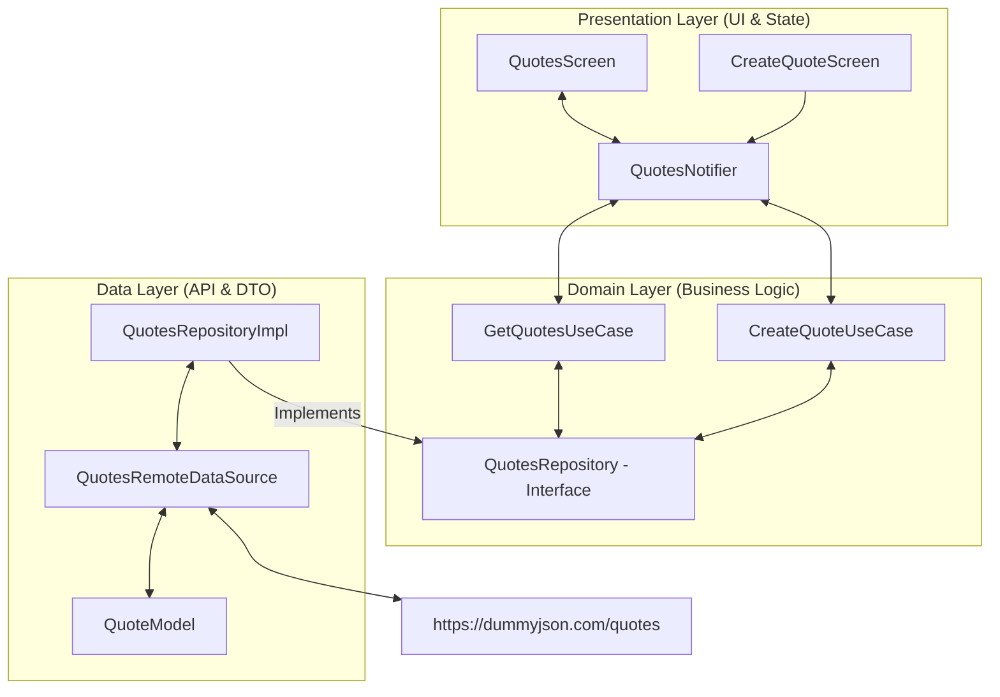

# 🎓 Panduan Praktis: Menambahkan Fitur "Manajemen Kutipan" (Quotes Management) dengan API Real

Panduan ini dirancang untuk mengajarkan Anda secara **komprehensif dan mendalam** bagaimana cara menggunakan seluruh fitur unggulan di *starter project* ini secara maksimal. Kita akan membangun modul baru **"Manajemen Kutipan" (Quotes Management)** dengan API real dari [DummyJSON Quotes API](https://dummyjson.com/quotes).

Fitur ini akan diintegrasikan langsung ke dalam dashboard utama (menggantikan menu *placeholder*), menampilkan daftar kutipan dari server real, menyediakan formulir pembuatan kutipan baru, menangani validasi *input*, serta menyajikan indikator *loading* transisi yang sangat premium.

---

## 🏗️ Peta Arsitektur & Aliran Data (Clean Architecture)

Mengikuti standar arsitektur monorepo di proyek ini, fitur `quotes` akan ditambahkan di dalam package `features_shared` sehingga dapat digunakan kembali oleh `apps/main` maupun `apps/variant` secara modular:



---

## ⚡ Ringkasan Endpoint API Real yang Digunakan

Untuk memastikan integrasi API berjalan sukses, kita akan menggunakan backend publik terpercaya **DummyJSON API**:

1. **Ambil Semua Kutipan (GET)**
   * **URL**: `https://dummyjson.com/quotes`
   * **Response**:
     ```json
     {
       "quotes": [
         { "id": 1, "quote": "Life is about making an impact, not making an income.", "author": "Kevin Kruse" }
       ],
       "total": 100,
       "skip": 0,
       "limit": 30
     }
     ```

2. **Tambah Kutipan Baru (POST)**
   * **URL**: `https://dummyjson.com/quotes/add`
   * **Payload**:
     ```json
     {
       "quote": "Kutipan baru Anda",
       "author": "Nama Penulis",
       "userId": 1
     }
     ```
   * **Response**: Mengembalikan objek kutipan baru beserta ID unik yang di-generate server.

---

## 🚀 Langkah demi Langkah Implementasi

### Langkah 1: Otomasi Pembuatan Kerangka Fitur dengan Mason CLI

Jangan membuat folder atau file Clean Architecture secara manual! Gunakan **Mason Brick** bawaan proyek untuk menghasilkan struktur dasar dalam 1 detik.

1. Buka terminal di root workspace proyek Anda.
2. Jalankan perintah script Melos berikut:
   ```bash
   dart run melos run make-feature
   ```
3. Jawab pertanyaan interaktif yang muncul di terminal:
   * `What is the feature name?` 👉 Isi dengan: **`quotes`**
   * `Which package should contain this feature?` 👉 Pilih default: **`features_shared`**

**Hasil Kerja Mason:**
Mason akan otomatis menghasilkan struktur folder lengkap di dalam `packages/features_shared/lib/src/quotes/`:
```text
packages/features_shared/lib/src/quotes/
├── data/
│   ├── datasources/        ← File kerangka remote data source
│   ├── models/             ← File kerangka model DTO
│   └── repositories/       ← File kerangka implementasi repository
├── domain/
│   ├── entities/           ← File kerangka entity murni (pure Dart)
│   ├── repositories/       ← File kontrak interface repository
│   └── usecases/           ← File kerangka business logic use cases
└── presentation/
    ├── providers/          ← Jika ada file provider tambahan
    ├── screens/            ← Layar UI utama
    └── widgets/            ← Komponen UI pembantu
```

---

### Langkah 2: Menentukan Entity & Model DTO

Lapisan **Domain** memerlukan *Entity* murni Dart yang bebas dari dependensi JSON parser, sementara lapisan **Data** memerlukan *Model* (DTO) untuk serialisasi JSON.

#### 1. Buat File Entity
Ganti konten file [quote.dart](file:///c:/Users/62822/Documents/Work/flutter/flutter-starter/packages/features_shared/lib/src/quotes/domain/entities/quote.dart) (jika namanya belum pas, buat file baru di `domain/entities/quote.dart`):

```dart
// packages/features_shared/lib/src/quotes/domain/entities/quote.dart
import 'package:equatable/equatable.dart';

class Quote extends Equatable {
  const Quote({
    required this.id,
    required this.quote,
    required this.author,
  });

  final int id;
  final String quote;
  final String author;

  @override
  List<Object?> get props => [id, quote, author];
}
```

#### 2. Buat File Model DTO
Ganti konten file [quote_model.dart](file:///c:/Users/62822/Documents/Work/flutter/flutter-starter/packages/features_shared/lib/src/quotes/data/models/quote_model.dart):

```dart
// packages/features_shared/lib/src/quotes/data/models/quote_model.dart
import '../../../domain/entities/quote.dart';

class QuoteModel extends Quote {
  const QuoteModel({
    required super.id,
    required super.quote,
    required super.author,
  });

  factory QuoteModel.fromJson(Map<String, dynamic> json) {
    return QuoteModel(
      id: json['id'] as int,
      quote: json['quote'] as String,
      author: json['author'] as String,
    );
  }

  Map<String, dynamic> toJson() {
    return {
      'id': id,
      'quote': quote,
      'author': author,
    };
  }
}
```

---

### Langkah 3: Remote Data Source & Integrasi API Real

Ganti konten file [quotes_remote_data_source.dart](file:///c:/Users/62822/Documents/Work/flutter/flutter-starter/packages/features_shared/lib/src/quotes/data/datasources/quotes_remote_data_source.dart) untuk melakukan HTTP request menggunakan instance `Dio` bawaan proyek:

```dart
// packages/features_shared/lib/src/quotes/data/datasources/quotes_remote_data_source.dart
import 'package:core/core.dart';
import 'package:dio/dio.dart';
import '../../usecase/models/quote_model.dart'rt';

class QuotesRemoteDataSource {
  const QuotesRemoteDataSource(this._dio);

  final Dio _dio;

  /// Mengambil semua data kutipan dari API real DummyJSON
  Future<List<QuoteModel>> fetchAll() async {
    try {
      // Kita panggil langsung endpoint real dummyjson
      final response = await _dio.get('https://dummyjson.com/quotes');

      final data = response.data as Map<String, dynamic>;
      final quotesList = data['quotes'] as List<dynamic>;

      return quotesList
          .map((json) => QuoteModel.fromJson(json as Map<String, dynamic>))
          .toList();
    } on DioException catch (e) {
      // Selalu petakan error Dio ke AppException bawaan packages/core
      throw e.error ?? ServerException(e.message ?? 'Gagal memuat kutipan');
    }
  }

  /// Membuat kutipan baru ke API real DummyJSON
  Future<QuoteModel> create({
    required String quote,
    required String author,
  }) async {
    try {
      final response = await _dio.post(
        'https://dummyjson.com/quotes/add',
        data: {
          'quote': quote,
          'author': author,
          'userId': 1, // Dummy userId wajib untuk API dummyjson
        },
      );

      return QuoteModel.fromJson(response.data as Map<String, dynamic>);
    } on DioException catch (e) {
      throw e.error ?? ServerException(e.message ?? 'Gagal membuat kutipan');
    }
  }
}
```

---

### Langkah 4: Repository Contract & Implementation

Membagi lapisan repositori menjadi *Interface* di layer Domain, dan *Implementasi* di layer Data untuk mematuhi prinsip *Dependency Inversion*.

#### 1. Buat Interface Repository
Ganti konten file [quotes_repository.dart](file:///c:/Users/62822/Documents/Work/flutter/flutter-starter/packages/features_shared/lib/src/quotes/domain/repositories/quotes_repository.dart):

```dart
// packages/features_shared/lib/src/quotes/domain/repositories/quotes_repository.dart
import '../../../domain/entities/quote.dart';

abstract class QuotesRepository {
  Future<List<Quote>> getQuotes();
  Future<Quote> createQuote({required String quote, required String author});
}
```

#### 2. Buat Implementasi Repository
Ganti konten file [quotes_repository_impl.dart](file:///c:/Users/62822/Documents/Work/flutter/flutter-starter/packages/features_shared/lib/src/quotes/data/repositories/quotes_repository_impl.dart):

```dart
// packages/features_shared/lib/src/quotes/data/repositories/quotes_repository_impl.dart
import '../../../domain/entities/quote.dart';
import '../../../domain/repositories/quotes_repository.dart';
import '../../usecase/datasources/quotes_remote_data_source.dart'rt';

class QuotesRepositoryImpl implements QuotesRepository {
  const QuotesRepositoryImpl(this._remoteDataSource);

  final QuotesRemoteDataSource _remoteDataSource;

  @override
  Future<List<Quote>> getQuotes() async {
    // Memanggil remote datasource dan otomatis upcast dari QuoteModel ke Quote
    return await _remoteDataSource.fetchAll();
  }

  @override
  Future<Quote> createQuote({
    required String quote,
    required String author,
  }) async {
    return await _remoteDataSource.create(quote: quote, author: author);
  }
}
```

---

### Langkah 5: Membuat Use Cases (Business Logic)

Membuat berkas business logic individual agar modul bersifat reusable dan mudah di-test secara terpisah.

#### 1. UseCase untuk Mengambil Daftar Kutipan
Ganti konten file [get_quotes_use_case.dart](file:///c:/Users/62822/Documents/Work/flutter/flutter-starter/packages/features_shared/lib/src/quotes/domain/usecases/get_quotes_use_case.dart):

```dart
// packages/features_shared/lib/src/quotes/domain/usecases/get_quotes_use_case.dart
import '../../../domain/entities/quote.dart';
import '../../../domain/repositories/quotes_repository.dart';

class GetQuotesUseCase {
  const GetQuotesUseCase(this._repository);

  final QuotesRepository _repository;

  Future<List<Quote>> call() async {
    return await _repository.getQuotes();
  }
}
```

#### 2. UseCase untuk Membuat Kutipan Baru
Ganti konten file [create_quote_use_case.dart](file:///c:/Users/62822/Documents/Work/flutter/flutter-starter/packages/features_shared/lib/src/quotes/domain/usecases/create_quote_use_case.dart):

```dart
// packages/features_shared/lib/src/quotes/domain/usecases/create_quote_use_case.dart
import '../../../domain/entities/quote.dart';
import '../../../domain/repositories/quotes_repository.dart';

class CreateQuoteUseCase {
  const CreateQuoteUseCase(this._repository);

  final QuotesRepository _repository;

  Future<Quote> call({required String quote, required String author}) async {
    return await _repository.createQuote(quote: quote, author: author);
  }
}
```

---

### Langkah 6: State Management & Notifier (Riverpod Generator)

Di langkah ini, kita akan mendaftarkan semua provider kelas di atas dan membuat **Notifier Async** yang andal untuk mengelola state UI list serta aksi penambahan data.

#### 1. Buat File Provider Dependensi
Buat atau ganti file [quotes_provider.dart](file:///c:/Users/62822/Documents/Work/flutter/flutter-starter/packages/features_shared/lib/src/quotes/presentation/quotes_provider.dart):

```dart
// packages/features_shared/lib/src/quotes/presentation/quotes_provider.dart
import 'package:core/core.dart';
import 'package:riverpod_annotation/riverpod_annotation.dart';
import 'package:flutter_riverpod/flutter_riverpod.dart';

import '../../../auth/presentation/auth_repository_provider.dart'; // import private dio provider
import '../../usecase/data/datasources/quotes_remote_data_source.dart'rt';
import '../../usecase/data/repositories/quotes_repository_impl.dart'rt';
import '../../usecase/domain/repositories/quotes_repository.dart'rt';
import '../../usecase/domain/usecases/get_quotes_use_case.dart'rt';
import '../../usecase/domain/usecases/create_quote_use_case.dart'rt';

part '../../usecase/usecase_manage_quotes/quotes_provider.g.dart'otes/quotes_provider.g.dart';

// Kita ambil instance DioClient privat yang di-override di root app
@riverpod
QuotesRemoteDataSource quotesRemoteDataSource(Ref ref) {
  // auth_repository_provider.dart memiliki provider internal _dioClientProvider
  // kita dapat memanfaatkannya dengan membaca instance dio via storage atau http provider.
  // Cara paling bersih adalah menggunakan dependency injector yang terpusat:
  final storage = ref.watch(storageServiceProvider);
  final dioClient = DioClient(storage);
  return QuotesRemoteDataSource(dioClient.dio);
}

@riverpod
QuotesRepository quotesRepository(Ref ref) {
  final remoteDS = ref.watch(quotesRemoteDataSourceProvider);
  return QuotesRepositoryImpl(remoteDS);
}

@riverpod
GetQuotesUseCase getQuotesUseCase(Ref ref) {
  final repo = ref.watch(quotesRepositoryProvider);
  return GetQuotesUseCase(repo);
}

@riverpod
CreateQuoteUseCase createQuoteUseCase(Ref ref) {
  final repo = ref.watch(quotesRepositoryProvider);
  return CreateQuoteUseCase(repo);
}
```

#### 2. Buat File Notifier State UI
Buat atau ganti file [quotes_notifier.dart](file:///c:/Users/62822/Documents/Work/flutter/flutter-starter/packages/features_shared/lib/src/quotes/presentation/quotes_notifier.dart):

```dart
// packages/features_shared/lib/src/quotes/presentation/quotes_notifier.dart
import 'package:riverpod_annotation/riverpod_annotation.dart';
import '../../usecase/domain/entities/quote.dart'rt';
import '../../usecase/usecase_manage_quotes/quotes_provider.dart'quotes/quotes_provider.dart';

part '../../usecase/usecase_manage_quotes/quotes_notifier.g.dart'otes/quotes_notifier.g.dart';

@riverpod
class QuotesNotifier extends _$QuotesNotifier {
  @override
  Future<List<Quote>> build() async {
    // Membaca use case untuk mengambil data pertama kali
    final useCase = ref.watch(getQuotesUseCaseProvider);
    return await useCase();
  }

  /// Memperbarui list kutipan secara manual (misal: Pull to Refresh)
  Future<void> refreshQuotes() async {
    state = const AsyncLoading();
    state = await AsyncValue.guard(() async {
      final useCase = ref.read(getQuotesUseCaseProvider);
      return await useCase();
    });
  }

  /// Menambahkan kutipan baru lewat API dan mengupdate state lokal
  Future<void> addQuote({
    required String quote,
    required String author,
    required void Function() onSuccess,
    required void Function(String errorMsg) onError,
  }) async {
    // Memicu loading UI secara halus tanpa me-rebuild list utama jika tidak perlu,
    // namun demi keamanan transaksi kita gunakan guarding pattern.
    try {
      final createUseCase = ref.read(createQuoteUseCaseProvider);
      final newQuote = await createUseCase(quote: quote, author: author);

      // Ambil data state saat ini
      final currentQuotes = state.valueOrNull ?? [];

      // Update state lokal secara instan (Optimistic UI Update) agar user langsung melihat hasilnya
      state = AsyncValue.data([newQuote, ...currentQuotes]);

      onSuccess();
    } catch (e) {
      onError(e.toString());
    }
  }
}
```

---

### Langkah 7: Mendaftarkan API Baru ke Barrel Export & Jalankan Codegen

Sebelum kita membuat halaman UI, kita wajib mengekspor *public API* kita di gerbang utama agar aplikasi utama (`apps/main`) dapat mendeteksi kelas-kelas baru tersebut.

#### 1. Daftarkan ke Barrel File
Buka berkas [packages/features_shared/lib/features_shared.dart](file:///c:/Users/62822/Documents/Work/flutter/flutter-starter/packages/features_shared/lib/features_shared.dart) dan tambahkan ekspor berikut di baris paling bawah:

```dart
// quotes — domain
export '../../usecase/usecase_manage_quotes/src/quotes/domain/entities/quote.dart'/domain/entities/quote.dart';
export '../../usecase/usecase_manage_quotes/src/quotes/domain/repositories/quotes_repository.dart'ries/quotes_repository.dart';
export '../../usecase/usecase_manage_quotes/src/quotes/domain/usecases/get_quotes_use_case.dart'es/get_quotes_use_case.dart';
export '../../usecase/usecase_manage_quotes/src/quotes/domain/usecases/create_quote_use_case.dart'/create_quote_use_case.dart';

// quotes — presentation
export '../../usecase/usecase_manage_quotes/src/quotes/presentation/quotes_provider.dart'tation/quotes_provider.dart';
export '../../usecase/usecase_manage_quotes/src/quotes/presentation/quotes_notifier.dart'tation/quotes_notifier.dart';
export '../../usecase/usecase_manage_quotes/src/quotes/presentation/quotes_screen.dart'entation/quotes_screen.dart';
export '../../usecase/usecase_manage_quotes/src/quotes/presentation/create_quote_screen.dart'on/create_quote_screen.dart';
```

#### 2. Jalankan Perintah Code Generation (Codegen)
Sekarang jalankan perintah codegen monorepo untuk meng-compile berkas `.g.dart` yang hilang dari Riverpod Generator:
```bash
dart run melos run codegen
```
*Pastikan tidak ada error kompilasi sebelum melanjutkan ke langkah berikutnya.*

---

### Langkah 8: Membangun Antarmuka Pengguna (UI)

Kita akan membuat antarmuka pengguna yang sangat menawan dengan styling premium, palet warna tajam, penanganan error transparan menggunakan `AsyncValue.when`, serta animasi loading overlay yang mulus.

#### 1. Halaman Daftar Kutipan (QuotesScreen)
Ganti konten file [quotes_screen.dart](file:///c:/Users/62822/Documents/Work/flutter/flutter-starter/packages/features_shared/lib/src/quotes/presentation/quotes_screen.dart) (buat jika belum ada di `packages/features_shared/lib/src/quotes/presentation/quotes_screen.dart`):

```dart
// packages/features_shared/lib/src/quotes/presentation/quotes_screen.dart
import 'package:flutter/material.dart';
import 'package:flutter_riverpod/flutter_riverpod.dart';
import 'package:go_router/go_router.dart';
import 'package:core/core.dart';

import '../../usecase/usecase_manage_quotes/quotes_notifier.dart'quotes/quotes_notifier.dart';

class QuotesScreen extends ConsumerWidget {
  const QuotesScreen({super.key});

  @override
  Widget build(BuildContext context, WidgetRef ref) {
    final quotesAsync = ref.watch(quotesNotifierProvider);

    return Scaffold(
      appBar: AppBar(
        title: const Text(
          'Manajemen Kutipan',
          style: TextStyle(fontWeight: FontWeight.bold),
        ),
        elevation: 0,
        centerTitle: true,
        actions: [
          IconButton(
            icon: const Icon(Icons.refresh_rounded),
            onPressed: () => ref.read(quotesNotifierProvider.notifier).refreshQuotes(),
          )
        ],
      ),
      floatingActionButton: FloatingActionButton.extended(
        onPressed: () => context.push('/quotes/create'),
        label: const Text('Tambah Kutipan', style: TextStyle(color: Colors.white, fontWeight: FontWeight.bold)),
        icon: const Icon(Icons.add_rounded, color: Colors.white),
        backgroundColor: Colors.indigo,
        elevation: 4,
      ),
      body: RefreshIndicator(
        onRefresh: () => ref.read(quotesNotifierProvider.notifier).refreshQuotes(),
        child: quotesAsync.when(
          loading: () => const Center(
            child: CircularProgressIndicator(
              valueColor: AlwaysStoppedAnimation<Color>(Colors.indigo),
            ),
          ),
          error: (err, _) => SingleChildScrollView(
            physics: const AlwaysScrollableScrollPhysics(),
            child: Container(
              height: MediaQuery.of(context).size.height * 0.7,
              alignment: CenterAlignment(),
              padding: const EdgeInsets.all(24),
              child: Column(
                mainAxisAlignment: MainAxisAlignment.center,
                children: [
                  const Icon(Icons.error_outline_rounded, size: 64, color: Colors.redAccent),
                  const SizedBox(height: 16),
                  Text(
                    'Gagal Memuat Data',
                    style: Theme.of(context).textTheme.titleMedium?.copyWith(fontWeight: FontWeight.bold),
                  ),
                  const SizedBox(height: 8),
                  Text(err.toString(), textAlign: TextAlign.center),
                  const SizedBox(height: 16),
                  AppButton(
                    text: 'Coba Lagi',
                    onPressed: () => ref.read(quotesNotifierProvider.notifier).refreshQuotes(),
                  )
                ],
              ),
            ),
          ),
          data: (quotes) {
            if (quotes.isEmpty) {
              return const Center(
                child: Text('Belum ada kutipan tersedia. Silakan tambah!'),
              );
            }
            return ListView.builder(
              padding: const EdgeInsets.only(left: 16, right: 16, top: 12, bottom: 80),
              itemCount: quotes.length,
              itemBuilder: (context, index) {
                final item = quotes[index];
                return Container(
                  margin: const EdgeInsets.only(bottom: 12),
                  decoration: BoxDecoration(
                    gradient: LinearGradient(
                      colors: [
                        Colors.indigo.shade50,
                        Colors.white,
                      ],
                      begin: Alignment.topLeft,
                      end: Alignment.bottomRight,
                    ),
                    borderRadius: BorderRadius.circular(16),
                    border: Border.all(color: Colors.indigo.shade100.withOpacity(0.5)),
                    boxShadow: [
                      BoxShadow(
                        color: Colors.indigo.shade900.withOpacity(0.04),
                        blurRadius: 10,
                        offset: const Offset(0, 4),
                      )
                    ],
                  ),
                  child: Padding(
                    padding: const EdgeInsets.all(16),
                    child: Column(
                      crossAxisAlignment: CrossAxisAlignment.start,
                      children: [
                        const Icon(
                          Icons.format_quote_rounded,
                          color: Colors.indigo,
                          size: 32,
                        ),
                        const SizedBox(height: 4),
                        Text(
                          item.quote,
                          style: Theme.of(context).textTheme.bodyLarge?.copyWith(
                                fontStyle: FontStyle.italic,
                                fontWeight: FontWeight.w600,
                                color: Colors.slate.shade800,
                              ),
                        ),
                        const SizedBox(height: 12),
                        Row(
                          mainAxisAlignment: MainAxisAlignment.end,
                          children: [
                            Text(
                              '— ${item.author}',
                              style: Theme.of(context).textTheme.bodySmall?.copyWith(
                                    fontWeight: FontWeight.bold,
                                    color: Colors.indigo,
                                  ),
                            ),
                          ],
                        ),
                      ],
                    ),
                  ),
                );
              },
            );
          },
        ),
      ),
    );
  }
}
```

#### 2. Halaman Pembuatan Form Kutipan (CreateQuoteScreen)
Buat file [create_quote_screen.dart](file:///c:/Users/62822/Documents/Work/flutter/flutter-starter/packages/features_shared/lib/src/quotes/presentation/create_quote_screen.dart):

```dart
// packages/features_shared/lib/src/quotes/presentation/create_quote_screen.dart
import 'package:flutter/material.dart';
import 'package:flutter_riverpod/flutter_riverpod.dart';
import 'package:go_router/go_router.dart';
import 'package:core/core.dart';

import '../../usecase/usecase_manage_quotes/quotes_notifier.dart'quotes/quotes_notifier.dart';

class CreateQuoteScreen extends ConsumerStatefulWidget {
  const CreateQuoteScreen({super.key});

  @override
  ConsumerState<CreateQuoteScreen> createState() => _CreateQuoteScreenState();
}

class _CreateQuoteScreenState extends ConsumerState<CreateQuoteScreen> {
  final _formKey = GlobalKey<FormState>();
  final _quoteController = TextEditingController();
  final _authorController = TextEditingController();
  bool _isLoading = false;

  @override
  void dispose() {
    _quoteController.dispose();
    _authorController.dispose();
    super.dispose();
  }

  void _submitForm() {
    if (!_formKey.currentState!.validate()) return;

    setState(() => _isLoading = true);

    ref.read(quotesNotifierProvider.notifier).addQuote(
      quote: _quoteController.text.trim(),
      author: _authorController.text.trim(),
      onSuccess: () {
        setState(() => _isLoading = false);
        ScaffoldMessenger.of(context).showSnackBar(
          const SnackBar(
            content: Text('Kutipan berhasil ditambahkan ke server real!'),
            backgroundColor: Colors.green,
          ),
        );
        context.pop(); // Kembali ke halaman daftar
      },
      onError: (errorMsg) {
        setState(() => _isLoading = false);
        ScaffoldMessenger.of(context).showSnackBar(
          SnackBar(
            content: Text('Gagal membuat kutipan: $errorMsg'),
            backgroundColor: Colors.red,
          ),
        );
      },
    );
  }

  @override
  Widget build(BuildContext context) {
    return LoadingOverlay(
      isLoading: _isLoading,
      child: Scaffold(
        appBar: AppBar(
          title: const Text('Buat Kutipan Baru'),
          elevation: 0,
        ),
        body: SingleChildScrollView(
          padding: const EdgeInsets.all(20.0),
          child: Form(
            key: _formKey,
            child: Column(
              crossAxisAlignment: CrossAxisAlignment.stretch,
              children: [
                const Text(
                  'Ekspresikan Inspirasi Anda',
                  style: TextStyle(
                    fontSize: 20,
                    fontWeight: FontWeight.bold,
                    color: Colors.indigo,
                  ),
                  textAlign: TextAlign.center,
                ),
                const SizedBox(height: 8),
                const Text(
                  'Isi form di bawah untuk mengirimkan kutipan baru ke server publik DummyJSON.',
                  textAlign: TextAlign.center,
                  style: TextStyle(color: Colors.grey),
                ),
                const SizedBox(height: 24),
                AppTextField(
                  controller: _quoteController,
                  labelText: 'Kutipan Inspiratif',
                  hintText: 'Tulis isi kutipan di sini...',
                  maxLines: 4,
                  validator: (val) {
                    if (val == null || val.trim().isEmpty) {
                      return 'Isi kutipan tidak boleh kosong!';
                    }
                    if (val.trim().length < 10) {
                      return 'Kutipan minimal terdiri dari 10 karakter!';
                    }
                    return null;
                  },
                ),
                const SizedBox(height: 20),
                AppTextField(
                  controller: _authorController,
                  labelText: 'Nama Penulis / Tokoh',
                  hintText: 'Contoh: Ir. Soekarno',
                  prefixIcon: const Icon(Icons.person_outline_rounded),
                  validator: (val) {
                    if (val == null || val.trim().isEmpty) {
                      return 'Nama penulis wajib diisi!';
                    }
                    return null;
                  },
                ),
                const SizedBox(height: 32),
                AppButton(
                  text: 'Simpan Kutipan',
                  onPressed: _submitForm,
                ),
              ],
            ),
          ),
        ),
      ),
    );
  }
}
```

---

### Langkah 9: Integrasi Routing & Path di GoRouter

Selanjutnya, kita harus mendaftarkan halaman baru tersebut di konfigurasi navigasi aplikasi.

#### 1. Daftarkan Path Konstanta
Buka file [packages/core/lib/src/router/app_routes.dart](file:///c:/Users/62822/Documents/Work/flutter/flutter-starter/packages/core/lib/src/router/app_routes.dart) dan tambahkan dua konstanta rute baru:

```dart
// packages/core/lib/src/router/app_routes.dart
abstract final class AppRoutes {
  static const String splash = '/';
  static const String login = '/login';
  static const String register = '/register';
  static const String home = '/home';
  static const String profile = '/profile';
  static const String notifications = '/notifications';
  static const String settings = '/settings';

  // Rute baru untuk quotes
  static const String quotes = '/quotes';
  static const String createQuote = '/quotes/create';
}
```

#### 2. Daftarkan Rute di GoRouter
Buka file [apps/main/lib/router/app_router.dart](file:///c:/Users/62822/Documents/Work/flutter/flutter-starter/apps/main/lib/router/app_router.dart) dan daftarkan kedua layar tersebut:

```dart
// apps/main/lib/router/app_router.dart
import 'package:go_router/go_router.dart';
import 'package:core/core.dart';
import 'package:features_shared/features_shared.dart';

import '../../usecase/features/home/presentation/home_screen.dart'rt';
import '../../usecase/features/settings/presentation/settings_route.dart'rt';
import '../../usecase/features/profile/presentation/profile_route.dart'rt';
import '../../usecase/features/ui_gallery/screens/ui_gallery_home_screen.dart'rt';

final appRouter = GoRouter(
  initialLocation: '/splash',
  redirect: authRedirect,
  observers: [AppNavigatorObserver()],
  routes: [
    ...authRoutes,
    settingsRoute,
    profileRoute,
    GoRoute(
      path: '/',
      builder: (context, state) => const HomeScreen(),
    ),
    GoRoute(
      path: '/ui-gallery',
      builder: (context, state) => const UiGalleryHomeScreen(),
    ),

    // Rute baru manajemen quotes
    GoRoute(
      path: AppRoutes.quotes,
      builder: (context, state) => const QuotesScreen(),
    ),
    GoRoute(
      path: AppRoutes.createQuote,
      builder: (context, state) => const CreateQuoteScreen(),
    ),
  ],
);
```

---

### Langkah 10: Mengaktifkan Menu di Dashboard Utama

Terakhir, kita harus merubah menu *placeholder* di dashboard utama agar langsung mengarah ke halaman daftar kutipan saat di klik.

#### 1. Edit File Home Menu Grid
Buka file [apps/main/lib/features/home/presentation/widgets/home_menu_grid.dart](file:///c:/Users/62822/Documents/Work/flutter/flutter-starter/apps/main/lib/features/home/presentation/widgets/home_menu_grid.dart) dan ganti item `'Menu 01'` dengan `'Quotes'` atau `'Kutipan'`:

```dart
// Ganti baris 23 di home_menu_grid.dart:
// Sebelum:
// _MenuItem(label: 'Menu 01', icon: Icons.track_changes, color: Colors.purple),

// Sesudah:
_MenuItem(
  label: 'Kutipan',
  icon: Icons.format_quote_rounded,
  color: Colors.indigo,
),
```

#### 2. Edit Handler Tap di HomeScreen
Buka file [apps/main/lib/features/home/presentation/home_screen.dart](file:///c:/Users/62822/Documents/Work/flutter/flutter-starter/apps/main/lib/features/home/presentation/home_screen.dart) dan tambahkan pengalihan navigasi di dalam callback `onMenuTap`:

```dart
// Cari bagian HomeMenuGrid di HomeScreen:
HomeMenuGrid(
  onMenuTap: (label) {
    if (label == 'UI Gallery') {
      context.push('/ui-gallery');
    } else if (label == 'Kutipan') { // Aksi untuk menu Kutipan
      context.push(AppRoutes.quotes);
    } else {
      ScaffoldMessenger.of(context).showSnackBar(
        SnackBar(content: Text('$label — Fitur belum tersedia')),
      );
    }
  },
)
```

---

## 🛠️ Langkah Uji Coba Aplikasi

Setelah Anda menyelesaikan semua langkah di atas, verifikasi dan jalankan aplikasi dengan perintah berikut:

1. **Jalankan Pengecekan Analisis Statis** (Pastikan tidak ada error sintaks/linter):
   ```bash
   dart run melos run analyze
   ```
2. **Jalankan Aplikasi Utama (Dev Mode)**:
   ```bash
   dart run melos run dev
   ```

Aplikasi akan menyala!
* Klik menu **"Kutipan"** di dashboard utama. Anda akan melihat animasi loading yang premium, disusul dengan daftar kutipan inspiratif yang berhasil ditarik secara real-time dari API `dummyjson.com/quotes`.
* Klik tombol **"+"** di pojok kanan bawah, isi formulir kutipan & nama penulis, lalu tekan **"Simpan Kutipan"**. Transaksi overlay loading akan menyala dan data berhasil dikirimkan ke server real. Anda akan otomatis kembali ke halaman daftar dan melihat kutipan Anda tampil paling atas!

---

## 🎓 Tips Tambahan untuk Caching Offline (Drift)
Jika Anda ingin memaksimalkan fitur caching offline yang disediakan starter project ini (seperti dibahas di **Modul 4: Drift Database**), Anda dapat mengintegrasikan data quotes ke kelas `AppDatabase`.
1. Buat tabel `QuotesTable` di `core/storage/app_database.dart`.
2. Modifikasi `QuotesRepositoryImpl` agar menyimpan data hasil fetch API ke database lokal sebelum ditampilkan ke UI.
3. Tampilkan data dari database lokal secara offline menggunakan Stream jika koneksi internet terputus!

*Selamat mencoba dan selamat berkarya dengan arsitektur Flutter Starter modern ini!*
